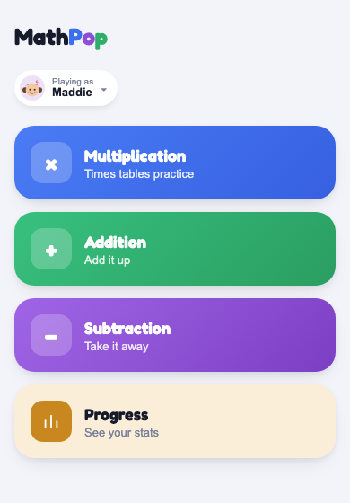

# MathPop

A quick multiplication/addition/subtraction quiz for the kids, built the same way as [PitchPop](https://github.com/marikalam/pitchpop) — same game-mode shape, just arithmetic instead of chords.

Live at **[marikalam.github.io/mathpop](https://marikalam.github.io/mathpop/)**.

## What it looks like

  

Pick "Playing as" (Maddie or Marcus) up top, then a card on the home screen: **Multiplication**, **Addition**, **Subtraction**, or **Random Mix** (a shuffled 5-problem round drawing from all three — each problem's card colors itself by whichever operation it actually is). Each mode starts a 5-problem round — see the problem in a big colored card, pick the answer from four options, get feedback (a chime and confetti if right, a buzz and the correct equation if not), then the next problem. **Progress** is a running per-kid record saved on the device: total problems answered, overall accuracy, and a breakdown by operation — credited to the real operation even for problems answered inside a Random Mix round.

Maddie gets the fuller range (multiplication factors up to the mid-teens, two-digit addition/subtraction); Marcus gets a simpler range (single-digit times tables, smaller sums). Both come from `buildProblem()` in `src/App.jsx` — adjust the ranges there if either kid needs harder or easier problems.

The four wrong-answer choices aren't random noise — they're generated from common slip-ups (off-by-one-factor, adding instead of multiplying, that kind of thing), so picking correctly takes actually knowing the answer instead of just avoiding obviously silly numbers.

## Running it

```
npm install
npm run dev
```

Add it to your phone's home screen from the browser (Share → Add to Home Screen on iPhone) and it behaves like a real app — full screen, one tap, no browser chrome.
