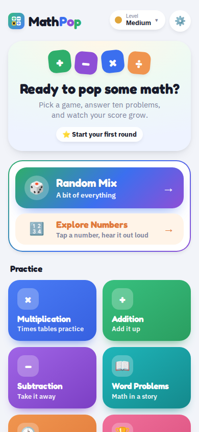

# MathPop

A quick multiplication/addition/subtraction quiz for the kids, built the same way as [PitchPop](https://github.com/marikalam/pitchpop) — same game-mode shape, just arithmetic instead of chords.

Live at **[marikalam.github.io/mathpop](https://marikalam.github.io/mathpop/)**.

## What it looks like

  

The home screen is laid out like PitchPop's: the logo with a **Grade** picker (Kindergarten through 4th grade) and ⚙️ Settings up top, a greeting card showing how many problems have been solved at this level and how many were right, a **Quick play** card with **Random Mix** (a shuffled round drawing from addition, subtraction and multiplication — each problem's card colors itself by whichever operation it actually is) and **Explore Numbers** (tap a number, hear it in English, Japanese, Cantonese or Mandarin), then six **Practice** cards picked for the grade (the whole page fits one phone screen, no scrolling). Kindergarten gets Addition, Subtraction, Comparing, Make a Ten, Place Value and Word Problems; 1st grade swaps Comparing for **Tell Time**; 2nd grade adds Measurement and the full **Skill Builders** list (2nd-grade concepts, unit by unit); 3rd and 4th grade bring in **Multiplication**, Stack & Solve, Big Numbers and Multi-Step problems. Random Mix and Word Problems stick to addition and subtraction until 3rd grade. The lists are `GRADE_PRACTICE` in `src/grades.js`. Each mode starts a round of ten — see the problem in a big colored card, answer it (type it, pick from choices, or write it by hand; see Settings), get feedback (a chime and confetti if right, a buzz and the correct equation if not), then the next problem.

Each grade sets its own number ranges for addition, subtraction and multiplication, from sums within 10 in Kindergarten up to three-digit numbers and times tables to 12 in 4th grade. They're all in `src/grades.js`: adjust them there if a grade feels too hard or too easy. Word Problems, Tell Time and Skill Builders use the Easy/Medium/Hard tier each grade maps to.

The four wrong-answer choices aren't random noise — they're generated from common slip-ups (off-by-one-factor, adding instead of multiplying, that kind of thing), so picking correctly takes actually knowing the answer instead of just avoiding obviously silly numbers.

## Running it

```
npm install
npm run dev
```

Add it to your phone's home screen from the browser (Share → Add to Home Screen on iPhone) and it behaves like a real app — full screen, one tap, no browser chrome.

## iPhone app

MathPop is also an iPhone app, set up the same way as PitchPop: the same web app wrapped with [Capacitor](https://capacitorjs.com) (`capacitor.config.json`, Xcode project in `ios/`). In the app the fonts and the speaking voice ship inside the app bundle, so it works offline from the first launch, and the "More apps" link is hidden.

```
npm run build:ios   # build with --mode ios, bundle the voice, copy into ios/
npm run open:ios    # open in Xcode (on a Mac)
```

Every push to `main` that touches the app builds it on a GitHub Mac and uploads it to TestFlight (`.github/workflows/testflight.yml`; it can also be run by hand from the Actions tab). Before the first run:

1. In App Store Connect, create a new app with the bundle ID **`com.marikalam.mathpop`** (same team as PitchPop).
2. In this repo's Settings → Secrets and variables → Actions, add the same three secrets PitchPop uses: `ASC_KEY_ID`, `ASC_ISSUER_ID`, `ASC_KEY_P8`.
